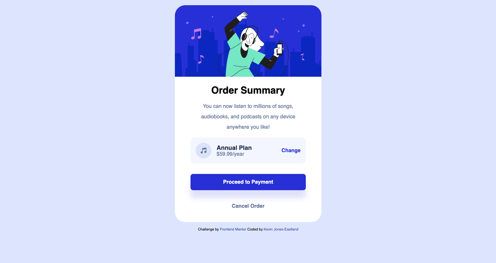

# Frontend Mentor - Order summary card solution

This is a solution to the
[Order summary card challenge on Frontend Mentor](https://www.frontendmentor.io/challenges/order-summary-component-QlPmajDUj).
Frontend Mentor challenges help you improve your coding skills by building
realistic projects.

## Table of contents

- [Overview](#overview)
  - [The challenge](#the-challenge)
  - [Screenshot](#screenshot)
  - [Links](#links)
- [My process](#my-process)
  - [Built with](#built-with)
  - [What I learned](#what-i-learned)
  - [Continued development](#continued-development)
  - [Useful resources](#useful-resources)
- [Author](#author)

## Overview

### The challenge

Users should be able to:

- See hover states for interactive elements

### Screenshot



### Links

- Solution URL: [Repo](https://github.com/kmje405/fem-order-summary-component)
- Live Site URL:
  [Live Site](https://fem-order-summary-component-kmje405.netlify.app/)

## My process

### Built with

- Semantic HTML5 markup
- CSS custom properties
- Flexbox
- Mobile-first workflow
- CSS layers for better organization
- Smooth transitions and hover effects

### What I learned

This project helped me practice several key CSS concepts:

**Flexbox Layout**: I used flexbox to align the plan elements (icon, details,
and change link) horizontally on the same line:

```css
.order-summary__plan.plan {
  display: flex;
  align-items: center;
  gap: 1rem;
}
```

**CSS Custom Properties**: I organized colors using CSS custom properties for
better maintainability:

```css
:root {
  --c-blue-700: hsl(245, 75%, 52%);
  --c-purple-500: hsl(245, 83%, 68%);
  --c-gray-600: hsl(224, 23%, 55%);
}
```

**Smooth Transitions**: I implemented hover effects with proper transition
timing:

```css
.order-summary__button--confirm {
  transition: background-color 300ms ease-in-out;
}

.order-summary__button--confirm:hover {
  background-color: var(--c-purple-500);
}
```

**CSS Layers**: I used CSS layers to organize styles and manage specificity:

```css
@layer global {
  /* Global styles */
}

@layer order-summary {
  /* Component-specific styles */
}
```

### Continued development

In future projects, I want to continue focusing on:

- Advanced CSS Grid layouts for more complex designs
- CSS animations and micro-interactions
- Accessibility improvements (ARIA labels, keyboard navigation)
- Responsive design patterns beyond mobile-first

### Useful resources

- [CSS Flexbox Guide](https://css-tricks.com/snippets/css/a-guide-to-flexbox/) -
  This helped me understand flexbox alignment and distribution properties.
- [CSS Custom Properties](https://developer.mozilla.org/en-US/docs/Web/CSS/Using_CSS_custom_properties) -
  Great resource for understanding CSS variables and their benefits.
- [CSS Transitions](https://developer.mozilla.org/en-US/docs/Web/CSS/CSS_Transitions/Using_CSS_transitions) -
  Helped me implement smooth hover effects.

## Author

- Website - [Kevin Jones-Eastland](https://eastlandjones.com/)
- Frontend Mentor -
  [@yourusername](https://www.frontendmentor.io/profile/yourusername)
